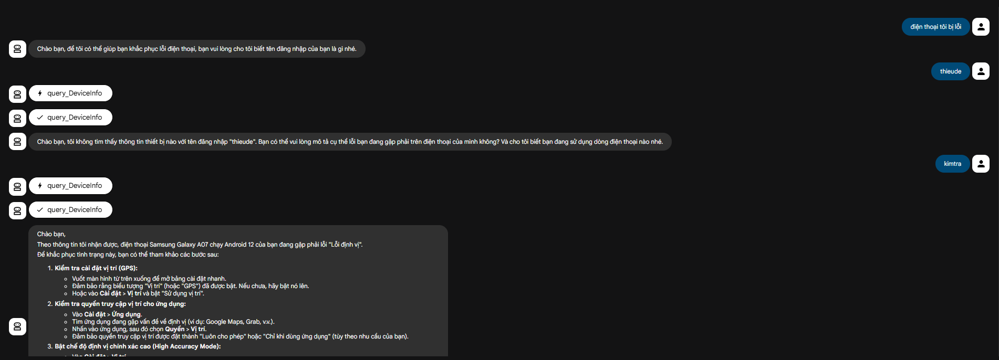
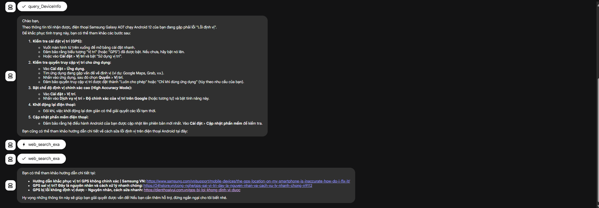

# Hướng Dẫn Bật Định Vị Điện Thoại

Dự án hỗ trợ hướng dẫn người dùng xử lý các lỗi cơ bản gặp phải khi sử dụng phần mềm Hộ Nghèo dựa trên loại thiết bị và phiên bản hệ điều hành. Đây là một phần của dự án hỗ trợ hộ nghèo, giúp người dùng dễ dàng kích hoạt định vị trên thiết bị của mình.

## 🎯 Mục đích

Dự án này được thiết kế để:
- Nhận thông tin về loại điện thoại và phiên bản hệ điều hành của người dùng kèm lỗi đang gặp phải
- Tự động tìm kiếm hướng dẫn phù hợp datasource
- Cung cấp hướng dẫn chi tiết, dễ hiểu về cách bật chế độ định vị trên thiết bị cụ thể

## ✨ Tính năng

- 🤖 **AI Agent**: Sử dụng Google Gemini để xử lý và phân tích thông tin
- 💾 **Kết nối Database**: Lấy thông tin hướng dẫn từ SQL Server
- 🔍 **Exa MCP**: Tìm kiếm hướng dẫn trên web thông qua Exa MCP server
- 🇻🇳 **Hỗ trợ tiếng Việt**: Tự động tìm kiếm các bài viết hướng dẫn bằng tiếng Việt

## 🛠️ Công nghệ sử dụng

- **Python 3.13+**
- **Google ADK (Agent Development Kit)**: Framework để xây dựng AI Agent
- **Gemini 2.5 Flash**: Model AI để xử lý và trả lời
- **SQL Server**: Cơ sở dữ liệu lưu trữ thông tin hướng dẫn
- **pyodbc**: Thư viện kết nối SQL Server
- **Exa MCP Server**: MCP server để tìm kiếm thông tin trên web
- **Node.js**: Cần thiết để chạy Exa MCP server

## 📋 Yêu cầu hệ thống

- Python 3.13 hoặc cao hơn
- Node.js (để chạy Exa MCP server)
- SQL Server (hoặc SQL Server Express)
- ODBC Driver 17 for SQL Server
- Tài khoản Google (để sử dụng Gemini API)
- Tài khoản Exa (để lấy EXA_API_KEY) - Đăng ký tại [exa.ai](https://exa.ai)

## 🚀 Cài đặt

### 1. Clone repository

```bash
git clone <repository-url>
cd locate_instruction
```

### 2. Tạo virtual environment

```bash
python -m venv venv
```

### 3. Kích hoạt virtual environment

**Windows:**
```bash
venv\Scripts\activate
```

**Linux/Mac:**
```bash
source venv/bin/activate
```

### 4. Cài đặt dependencies

```bash
pip install -r requirements.txt
```

### 5. Cài đặt Node.js

Đảm bảo đã cài đặt **Node.js** (version 18 hoặc cao hơn) để chạy Exa MCP server:
- Tải từ [nodejs.org](https://nodejs.org/)
- Kiểm tra cài đặt: `node --version` và `npm --version`

### 6. Cấu hình môi trường

Tạo file `.env` trong thư mục gốc của dự án với nội dung:

```env
SERVER=your_server_name
DATABASE=your_database_name
UID=your_username
PWD=your_password
TABLE=your_table_name
EXA_API_KEY=your_exa_api_key
```

**Ví dụ:**
```env
SERVER=localhost\SQLEXPRESS
DATABASE=LocationGuideDB
UID=sa
PWD=your_secure_password
TABLE=SysOption
EXA_API_KEY=your_exa_api_key_here
```

**Lưu ý:** Để lấy EXA_API_KEY:
1. Đăng ký tài khoản tại [exa.ai](https://exa.ai)
2. Vào dashboard và lấy API key
3. Thêm vào file `.env`

### 7. Cài đặt ODBC Driver

Đảm bảo đã cài đặt **ODBC Driver 17 for SQL Server**:

## 📖 Cấu trúc dự án

```
locate_instruction/
├── __init__.py          # Module initialization
├── agent.py             # Định nghĩa AI Agent
├── db.py                # Kết nối và quản lý database
├── tools.py             # Các công cụ/tool cho agent
├── requirements.txt     # Dependencies
├── .env                 # Cấu hình môi trường (không commit)
└── README.md           # Tài liệu hướng dẫn
```

### Cách hoạt động

1. **Người dùng yêu cầu hướng dẫn**: Cung cấp userid hoặc thông tin thiết bị
2. **Lấy thông tin thiết bị**: Agent sử dụng `query_DeviceInfo` để lấy thông tin từ database
3. **Phân tích lỗi**: Agent đọc trường `StatusMessage` từ database để xác định lỗi cụ thể mà người dùng đang gặp phải
4. **Tìm kiếm giải pháp**: Agent tự động sử dụng Exa MCP tools để tìm kiếm các bài viết hướng dẫn giải quyết lỗi bằng tiếng Việt trên web
5. **Tổng hợp và trả lời**: Agent tổng hợp thông tin và cung cấp hướng dẫn chi tiết kèm link bài viết tiếng Việt

## 📸 Demo

Dưới đây là một số ví dụ về cách Agent hoạt động:





## 📝 Cấu trúc Database

Cơ sở dữ liệu chứa thông tin hướng dẫn về cách bật định vị cho các loại điện thoại và phiên bản hệ điều hành khác nhau.

Bảng trong database cần có các cột chứa:
- Thông tin về loại điện thoại
- Phiên bản hệ điều hành


